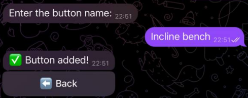
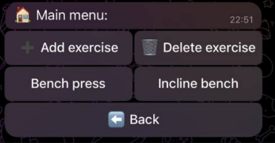

# Workout Tracker Telegram Bot

A multilingual Telegram bot for tracking workout progress and managing user fitness profiles. Built in modern C++ with `tgbot-cpp`, `SQLite`, and `CMake`.  
Includes inline keyboards for better UX and modular code structure.

---

## Features

- Track workout progress  
- Manage user profiles  
- Custom keyboards for ease of use  
- Multilanguage support
- Group chat support (planned)
  
---

## Tech Stack
- C++20
- tgbot-cpp
- SQLite
- CMake
- Git & GitHub Actions
- vcpkg

  
---

## Prerequisites

- C++20 compiler (MSVC, GCC, Clang)  
- CMake 3.18+  
- Git  
- [vcpkg](https://github.com/microsoft/vcpkg) package manager  

---
## 📷 Screenshots

### 🏁 Start Menu


### 🏋️ Exercise Management


### ➕ Add New Exercise


### ✅ Updated Menu



---

## How to create your Telegram bot and get a token

1. Open Telegram and find [BotFather](https://t.me/BotFather)  
2. Send `/newbot` command  
3. Follow instructions to set the bot name and username  
4. Copy the generated **bot token** — you will need it for `.env` configuration

---

## Setup and Build

### 1. Clone the repository

```bash
git clone https://github.com/mik-varantsou/workout-tracker-telegram-bot.git
cd workout-tracker-telegram-bot
```

### 2. Initialize submodules

```bash
git submodule update --init --recursive
```

### 3. Install dependencies with vcpkg
If you don’t have vcpkg installed yet, clone and bootstrap it first:
```bash
git clone https://github.com/microsoft/vcpkg.git

cd vcpkg

.\bootstrap-vcpkg.bat
```

Then install the required libraries:
```bash
.\vcpkg.exe install sqlitecpp zlib openssl curl boost-system boost-filesystem boost-property-tree boost-lexical-cast boost-asio
```

Integrate vcpkg with your system (optional but recommended):

```bash
.\vcpkg.exe integrate install
```


### 4. Configure and build the project
Make a build directory and generate build files with CMake, specifying the vcpkg toolchain file. Replace path\to\vcpkg with your actual vcpkg folder path:

```bash
mkdir build

cd build

cmake .. -DCMAKE_TOOLCHAIN_FILE=path\to\vcpkg\scripts\buildsystems\vcpkg.cmake

cmake --build .
```
This will compile the project and produce an executable.
---

## Configuration
To run the bot, you need a Telegram bot token:
1. Create a .env file in the project root (same folder as tgbot_new.exe)
2. Add your token inside .env like this:
   ```ini
   BOT_TOKEN=your_telegram_bot_token_here
   ```
Keep this token secret — do not share it publicly.


---


## Running the Bot
After building, run the executable from the build folder:
```bash
.\tgbot_new.exe
```

---

## Contribution and Support
If you find bugs, have ideas, or want to contribute code — feel free to open issues or submit pull requests.

## Contacts
Created by mik-varantsou

For questions or suggestions, please open an issue or contact me via GitHub.


